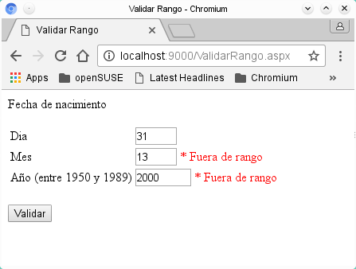

# Controles de validación ASP .NET II (RangeValidator)

Si necesitamos asegurarnos que el valor de un campo se encuentre dentro de unos limites es decir dentro de un rango especifico, el control RangeValidator se asegura que el valor de un campo sea del tipo que necesitemos y se encuentre dentro de los valores iniciales y finales que necesitemos.

Lo instalamos: copiamos el ensamblado a la carpeta bin ejecutamos xsp y abrimos el navegador con la dirección <i>http://localhost:8080/ValidarRango.aspx.</i>
Si todo es correcto se mostrará la ejecucción como en la siguiente imagen:

<h3>Propiedades del control RangeValidator</h3>

<strong>Display:</strong> Esta propiedad puede tener 3 valores:
<ul> 
<li><strong>Static</strong> es la propiedad predeterminada, reserva un espacio suficiente en la página para mostrar el mensaje de error.</li>
<li><strong>Dynamic:</strong> el espacio para mostrar el mensaje no se reserva, cuando el mensaje se despliega se desplaza el contenido existente en la página.</li>
<li><strong>None:</strong> el mensaje no será desplegado en el lugar del control sino en el control ValidationSummary si se localiza en la misma página.</li>
</ul>

<strong>Type:</strong> El tipo de datos de los valores a comparar, los tipos de datos disponibles para este control son: Currency (moneda), Date (fecha), Double (valor de punto flotante), Integer (Entero sin punto decimal), String (Cadena).

<strong>ControlToValidate:</strong> El identificador del control donde obtenemos el valor para validar.

<strong>MinimumValue:</strong> El valor mínimo del rango.

<strong>MaximumValue:</strong> El valor máximo del rango.

